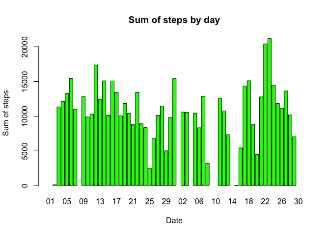
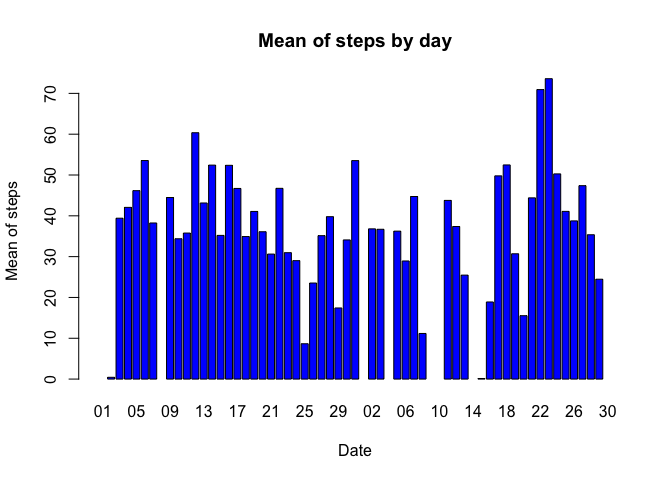
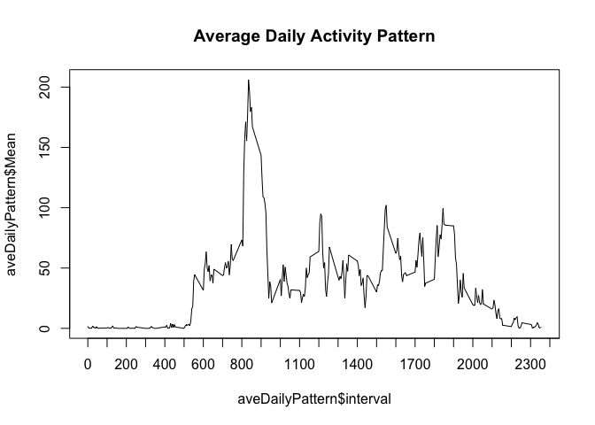
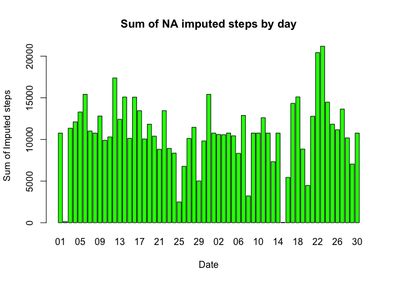
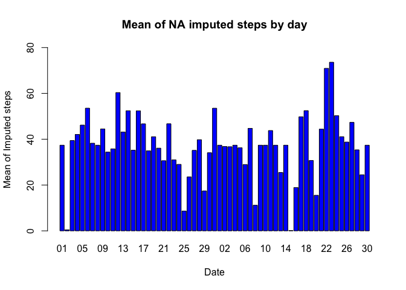
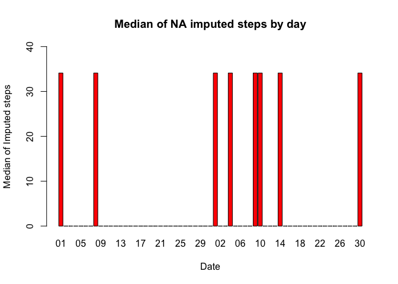
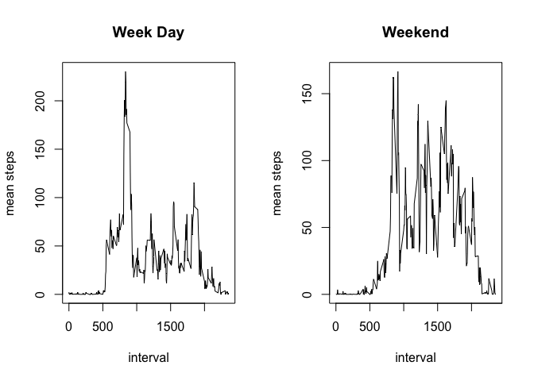

Assignment 1 - Reproducable Research Nov 2016
================
David Klemitz
5 December 2016

Summary
-------

This R Markdown document forms the basis of answering the questions posed in Assignment 1 of Reproducable Research the link to which is given [here](https://github.com/DavidAKZ/RepData_PeerAssessment1). Each question together with code, answers and relevant plots is addressed in turn.

### 1.Loading and preprocessing the data

#### --Load the data

``` r
thisFile <- 'https://d396qusza40orc.cloudfront.net/repdata%2Fdata%2Factivity.zip'

if(!file.exists('quantifiedSelf')){
        dir.create('quantifiedSelf')
}

print('Downloading data')
```

    ## [1] "Downloading data"

``` r
#download.file(thisFile, './quantifiedSelf/activityData.zip', method = 'curl')

print('Unzip the file')
```

    ## [1] "Unzip the file"

``` r
unzip(zipfile="./quantifiedSelf/activityData.zip")
```

#### --Process/transform the data into a format suitable for analysis

``` r
install.packages("dplyr",repos = "http://cran.us.r-project.org")
```

    ## 
    ## The downloaded binary packages are in
    ##  /var/folders/fv/6snjyvm10q74px9dvb8wk6cc0000gn/T//RtmpAtqxjR/downloaded_packages

``` r
library(dplyr)
```

    ## 
    ## Attaching package: 'dplyr'

    ## The following objects are masked from 'package:stats':
    ## 
    ##     filter, lag

    ## The following objects are masked from 'package:base':
    ## 
    ##     intersect, setdiff, setequal, union

``` r
thisActivity <- read.csv(file='activity.csv', sep=',')
# convert the factor variabe to Date class
thisActivity$date <- as.Date(as.factor(thisActivity$date))

# read the dataframe into a table dataframe for processing with the dplyr package
dt.activity <- tbl_df(thisActivity)
```

### 2.What is mean total number of steps taken per day (ignore the missing values)?

#### --Make a histogram of the total number of steps taken each day

``` r
daily<- group_by(dt.activity, date)

sumDailySteps <- summarise(daily, sum(steps))

barplot(sumDailySteps$`sum(steps)`, space=NULL, names.arg=format(sumDailySteps$date,'%d'), xlab='Date', ylab='Sum of steps', density=NULL, col='Green', main='Sum of steps by day')
```



#### --Calculate and report the mean and median total number of steps taken per day

#### \*Mean

``` r
meanDailySteps <- summarise(daily, mean(steps))

barplot(meanDailySteps$`mean(steps)`, space=NULL, names.arg=format(meanDailySteps$date,'%d'), xlab='Date', ylab='Mean of steps', density=NULL, col='Blue', main='Mean of steps by day')
```



#### \*Median

``` r
medianDailySteps <- summarise(daily, median(steps))
```

The piece of code above would produce the median, however due to the fact more than half the step values are **zero**, the median value for each day is in fact 0.

### 3.What is the average daily activity pattern?

#### --Make a time series plot (i.e. type = "l") of the 5-minute interval (x-axis) and the average number of steps taken, averaged across all days (y-axis)

``` r
#set the time interval for the x-axis
interval<-data.frame(unique(daily$interval))

aveDailyPattern<-daily %>% group_by(interval) %>% summarise(Mean = mean(steps, na.rm = TRUE))

plot(aveDailyPattern$interval,aveDailyPattern$Mean, type='l',xaxt='n',main='Average Daily Activity Pattern')

axis(1, at = seq(0, 2500, by = 100), las=1)
```



#### --Which 5-minute interval, on average across all the days in the dataset, contains the maximum number of steps?

``` r
intervalMaxSteps<-aveDailyPattern[rev(order(aveDailyPattern$Mean)),]

head(intervalMaxSteps)
```

    ## # A tibble: 6 × 2
    ##   interval     Mean
    ##      <int>    <dbl>
    ## 1      835 206.1698
    ## 2      840 195.9245
    ## 3      850 183.3962
    ## 4      845 179.5660
    ## 5      830 177.3019
    ## 6      820 171.1509

The 5 minute interval of **08 35** has the maximum average number of steps =**206.**

### 3.Imputing missing values

#### --Calculate and report the total number of missing values in the dataset (i.e. the total number of rows with NAs)

Using the following code, the number of NA values in dt.activity$steps is **2304**

``` r
missingSteps<- sum(is.na(daily$steps))
print(missingSteps)
```

    ## [1] 2304

#### --Devise a strategy for filling in all of the missing values in the dataset.

We will replace the NA values in dt.activity$steps with the average value for that particular time interval. To to this simply, we will load the 'Z's Ordered Observations' or Zoo package and library.

``` r
install.packages("zoo",repos = "http://cran.us.r-project.org")
```

    ## 
    ## The downloaded binary packages are in
    ##  /var/folders/fv/6snjyvm10q74px9dvb8wk6cc0000gn/T//RtmpAtqxjR/downloaded_packages

``` r
library(zoo)
```

    ## 
    ## Attaching package: 'zoo'

    ## The following objects are masked from 'package:base':
    ## 
    ##     as.Date, as.Date.numeric

``` r
dt.activity$steps <- ave(dt.activity$steps, dt.activity$interval, FUN=na.aggregate)
```

#### --Create a new dataset that is equal to the original dataset but with the missing data filled in.

``` r
dailyImpute <- group_by(dt.activity,date)
sumImputeSteps <- summarise(dailyImpute, sum(steps))
```

#### --Make a histogram of the total number of steps taken each day

``` r
barplot(sumImputeSteps$`sum(steps)`,space=NULL, names.arg=format(sumDailySteps$date,'%d'), xlab='Date', ylab='Sum of Imputed steps', density=NULL, col='Green', main='Sum of NA imputed steps by day')
```



#### ----Calculate and report the mean number of steps taken per day

``` r
meanImputeSteps <- summarise(dailyImpute, mean(steps))

barplot(meanImputeSteps$`mean(steps)`,space=NULL, names.arg=format(meanDailySteps$date,'%d'), xlab='Date', ylab='Mean of Imputed steps', density=NULL, col='Blue', main='Mean of NA imputed steps by day',ylim= c(0,80))
```



#### ----Calculate and report the median total number of steps taken per day

``` r
medianImputeSteps <- summarise(dailyImpute, median(steps))

barplot(medianImputeSteps$`median(steps)`,space=NULL, names.arg=format(sumDailySteps$date,'%d'), xlab='Date', ylab='Median of Imputed steps', density=NULL, col='Red', main='Median of NA imputed steps by day', ylim=c(0,40))
```



#### ----Do the above values differ from the estimates from the first part of the assignment?

With the sum and mean estimates, imputing the NA values with the average steps for any particular time interval has the effect of filling in the hisogram. With the median, the imputed values cause eight (8) values to be drawn where before there was none. This is because in the majority of 5 minute interval cases, there are more zero values than non-zero values.

#### ----What is the impact of imputing missing data on the estimates of the total daily number of steps?

As above.

### 4.Are there differences in activity patterns between weekdays and weekends?

#### --Create a new factor variable in the dataset with two levels – “weekday” and “weekend” indicating whether a given date is a weekday or weekend day

``` r
weekdays1 <- c('Monday', 'Tuesday', 'Wednesday', 'Thursday', 'Friday')

dailyImpute$wday <- factor((weekdays(dailyImpute$date) %in% weekdays1),levels = c(TRUE,FALSE),labels = c('weekday','weekend'))
```

#### --Make a panel plot containing a time series plot (i.e. 𝚝𝚢𝚙𝚎 = "𝚕") of the 5-minute interval (x-axis) and the average number of steps taken, averaged across all weekday days or weekend days (y-axis).

``` r
par(mfrow=c(1,2))

weekDayDailyImpute <- subset(dailyImpute, dailyImpute$wday=='weekday')

weekDayDailyImputePattern<-weekDayDailyImpute %>% group_by(interval) %>% summarise(Mean = mean(steps))

plot(weekDayDailyImputePattern$interval,weekDayDailyImputePattern$Mean, type='l', xlab='interval' , ylab='mean steps',main='Week Day')

weekendDailyImpute <- subset(dailyImpute, dailyImpute$wday=='weekend')

weekendDailyImputePattern <- weekendDailyImpute %>% group_by(interval) %>% summarise(Mean = mean(steps))

plot(weekendDailyImputePattern$interval,weekendDailyImputePattern$Mean, xaxt='n', type='l', xlab='interval', ylab='mean steps', main='Weekend')
axis(1, at = seq(0, 2500, by = 500), las=1)
```


